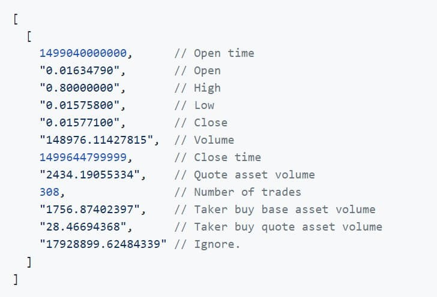

# Binance-data-collection-real-time-and-historical
## Summary of task:
*This task has consisted of two-part. First, the close prices of BTC in every minute candles from 24 hours ago needed to be gathered. Secondly, the aforementioned part must be done for the next 24 hours in real-time. Data have been collected from <a href='https://www.binance.com/en'>binance.com</a>*
</br>

## Bitcoin’s historical prices data in xlsx format:
<p align="left"> For this part of the task, I found a third-party library named <a href='https://python-binance.readthedocs.io/en/latest/'>python-binance</a>. The way this library work needed Binance API to connect to the Binance servers via Python or several other programming languages. due to that, the first step is to create an account with Binance. An API key should be created after it. </p>
</br>

**Installing library:**

```
  pip install python-binance
```

**Importing library:**

```
  from binance. client import Client
```
</br>

**Initialize the client by passing API key and secret:**

```
  client = Client (api_key, api_secret)
```
</br>

**make the call for historical data by requesting historical candle data:**

```
  bars = client.get_historical_klines ('BTCUSDT'(symbol), 
                                       '1m'(Candles interval), 
                                       timestamp(Star getting data from this Timestamp), 
                                       limit=1000)
```
</br>

In the background, this endpoint will continuously query the API in a loop, collecting 1000 price points at a time, until all data from the start point reaches the now timestamp.


